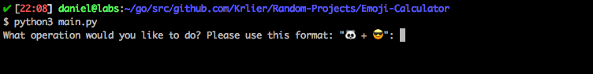
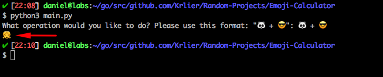

# Emoji Caculator

This is a simple calculator app with a very peculiar feature, it doesn't simply use numbers, it uses emojis 😎!

I started developing it as an exercise to learn Python, but after the calculator was done I felt like it needed an extra touch.

---

## How to run

You can run the app with the following commands:

```sh
$ python3 main.py
```

After that, you should see the following screen:



Now, all you have to do is calculate!

